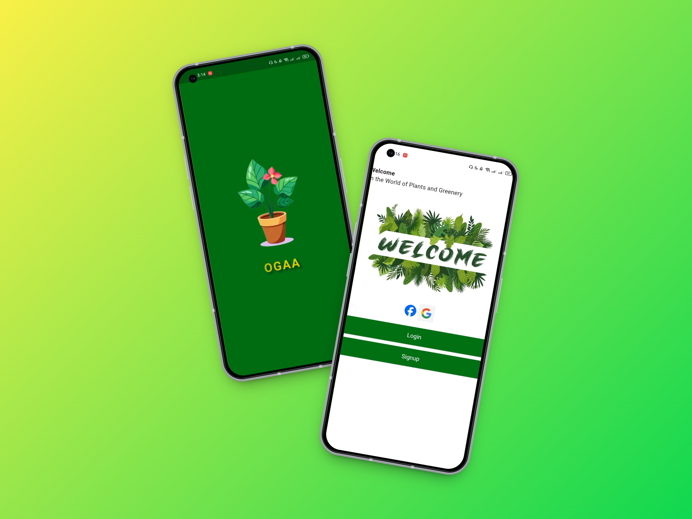
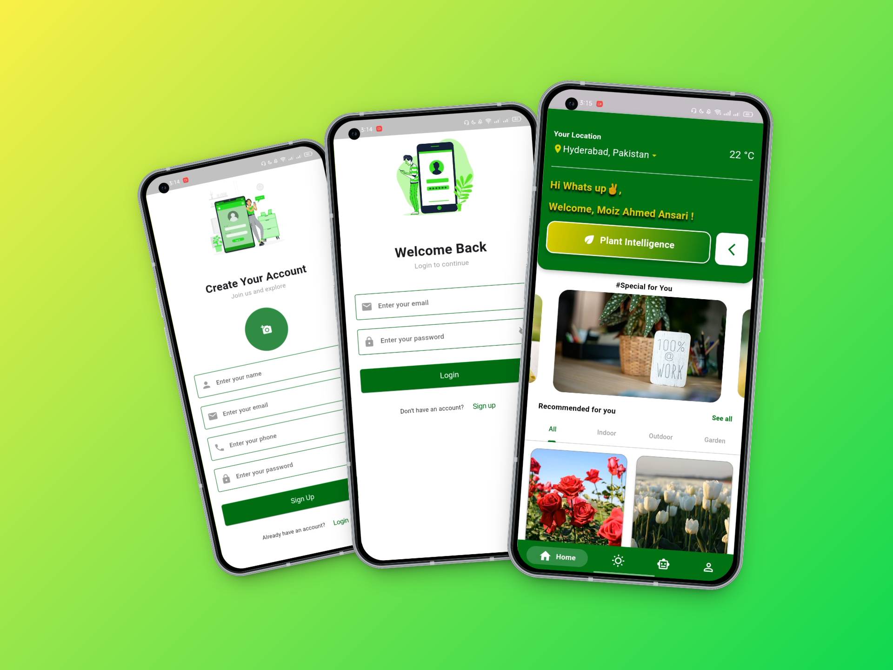
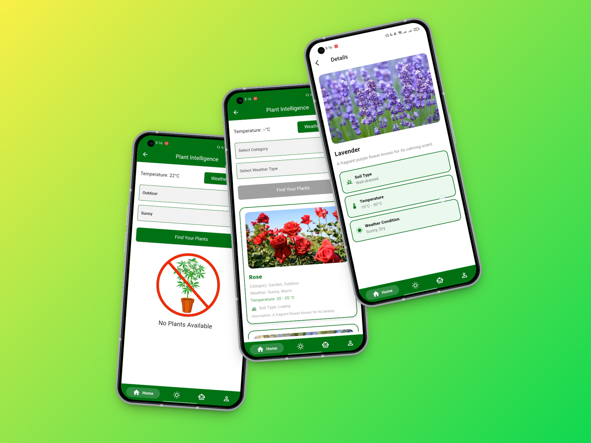
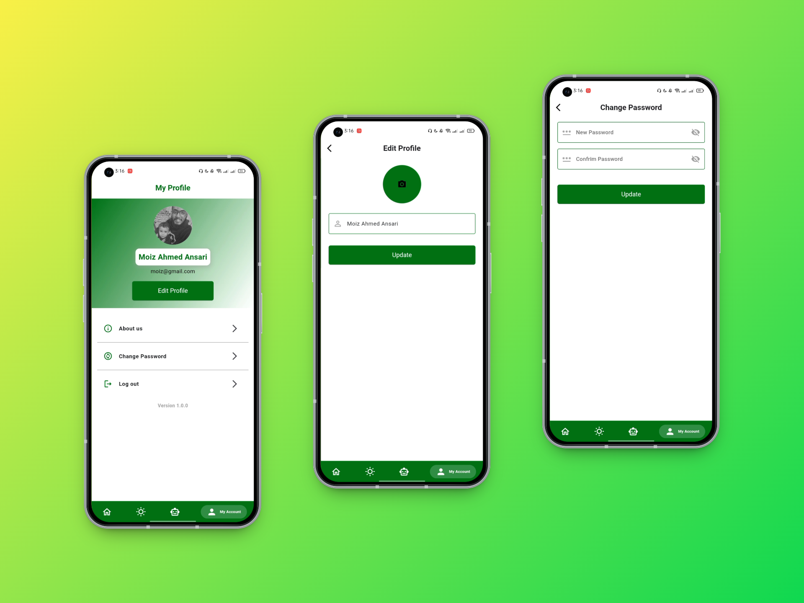

<h1>🌿 OGAA – Organic Gardening Assistant App</h1>

A personalized gardening assistant that suggests the right plants using live weather, location, and category insights.
<strong>OGAA</strong> helps users grow the right plants based on their <strong>location</strong>, <strong>weather</strong>, and <strong>plant category</strong> — all in a beautifully designed Flutter application.

<h2>🚀 Features</h2>
<ul>
  <li>🔐 Firebase Authentication (Email/Password)</li>
  <li>📍 Live Weather Detection using Location and Geocoding Packages</li>
  <li>🌤️ Smart Plant Recommendation based on:
    <ul>
      <li>Location and it's Temperature</li>
      <li>Weather Type (Sunny, Cloudy, Rainy, etc.)</li>
      <li>Category Type (Outdoor, Indoor, Garden)</li>
    </ul>
  </li>
  <li>🤖 OGAA Chatbot powered by Gemini</li>
  <li>🪴 Explore Offline Plant Library (All, Outdoor, Indoor, Garden)</li>
  <li>📋 Detailed Plant Information Pages</li>
  <li>👤 Profile Management (Update Info & Change Password)</li>
  <li>🎯 Clean & Modern UI/UX</li>
  <li>🧱 Built using Flutter + Provider + Firebase + Gemini AI</li>
</ul>

<h2>📱 App Screens – OGAA UI Mockups</h2>

<blockquote>
 Smart gardening meets intelligence — explore the <strong>OGAA App</strong>.
</blockquote>

<table width="100%" align="center" cellspacing="10">
  <tr>
    <td align="center" valign="top" style="border: 1px solid #ccc; padding: 15px;">
       
      <strong>🚀 Getting Started</strong> 
      Includes Splash and Welcome screens — with options to Sign In or Sign Up and begin the gardening journey.
    </td>
    <td align="center" valign="top" style="border: 1px solid #ccc; padding: 15px;">
       
      <strong>🔐 Authentication + Home</strong> 
      SignUp - SignIn pages and a stunning Home screen featuring sliders, offline plant grids, and the Plant Intelligence button.
    </td>
  </tr>
  <tr>
    <td align="center" valign="top" style="border: 1px solid #ccc; padding: 15px;">
       
      <strong>🧠 Plant Intelligence</strong> 
      Auto-fetches weather by location; users select plant category and weather type — get smart plant suggestions instantly.
    </td>
    <td align="center" valign="top" style="border: 1px solid #ccc; padding: 15px;">
       
      <strong>🤖 AI Chatbot + Explore</strong> 
      Chat with OGAA using Gemini AI, view all plants, and explore OGAA's purpose in the About section.
    </td>
  </tr>
  <tr>
    <td colspan="2" align="center" valign="top" style="border: 1px solid #ccc; padding: 15px;">
       
      <strong>👤 Profile</strong> 
      Manage your profile, update your name/photo, or securely change your password with a smooth UI flow.
    </td>
  </tr>
</table>

  <i>🌼 Let OGAA guide your green journey — choose the right plants at the right time, every time.</i>

<h2>📦 Tech Stack</h2>

<ul>
  <li><strong>Flutter</strong> – UI development</li>
  <li><strong>Dart</strong> – Programming language</li>
  <li><strong>Provider</strong> – State management</li>
  <li><strong>Firebase</strong> – Authentication, Firestore, Storage</li>
  <li><strong>Gemini AI</strong> – AI Chatbot (OGAA Chatbot)</li>
  <li><strong>Geocoding & Location</strong> – Detect user’s current location</li>
  <li><strong>Weather API</strong> – Live weather integration</li>
  <li><strong>VS Code</strong> – Development environment</li>
</ul>

<h2>📂 Folder Structure (Core)</h2>

<!-- # ogaa

A new Flutter project.

## Getting Started

This project is a starting point for a Flutter application.

A few resources to get you started if this is your first Flutter project:

- [Lab: Write your first Flutter app](https://docs.flutter.dev/get-started/codelab)
- [Cookbook: Useful Flutter samples](https://docs.flutter.dev/cookbook)

For help getting started with Flutter development, view the
[online documentation](https://docs.flutter.dev/), which offers tutorials,
samples, guidance on mobile development, and a full API reference. -->